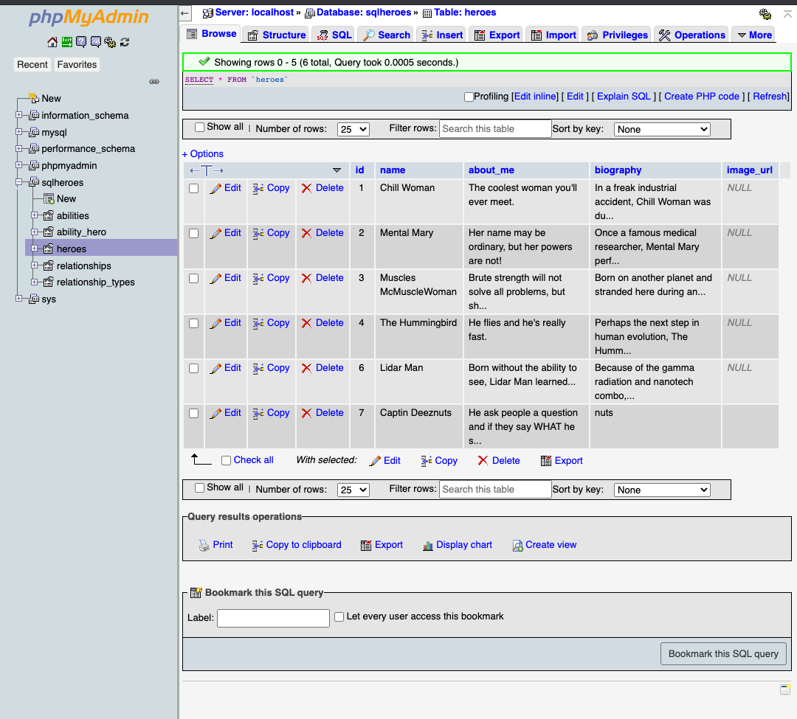
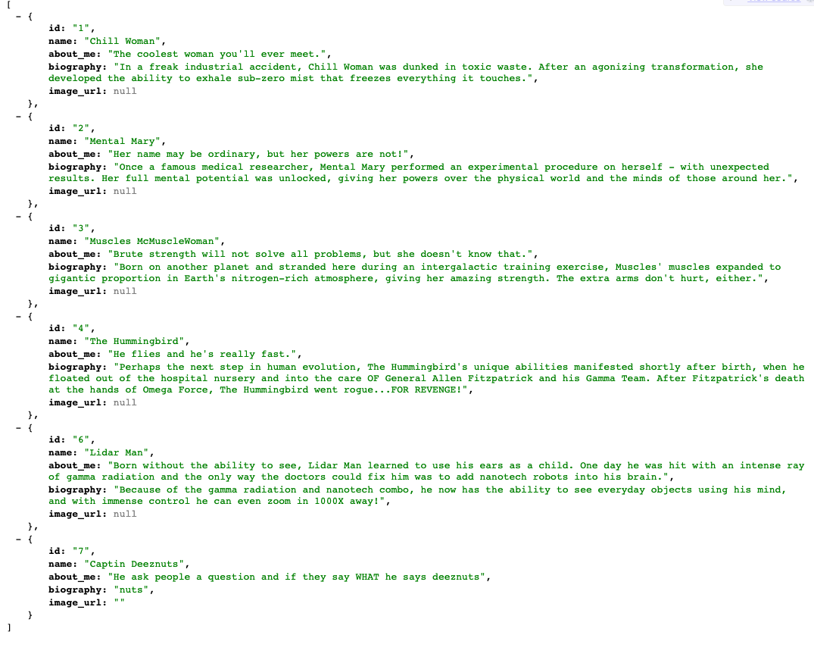
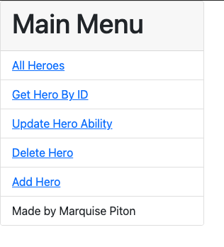

# A platform that keeps heroes connected! 📱

This project is focused on PHP and MySQL. I create the backend for Facebook for superheroes. 

# Tech Stack 
    * PHP
    * CRUD Operations
    * MySQL
    
I created a database called 'sqlheroes' using phpMyadmin as my database solution. Within the 'sqlheroes', I made these tables: 

* Abilities
* Ability_hero
* heroes
* relationships 
* relationship_types

Then using php, I build 5 api's: 

* getAllHeroes                                 
* addHero
* getHeroByID
* updateAbility
* deleteHero
* 

Finally, I created a back-end focus Facebook version for Heroes called "Herobook!" Well...Kind of. 😅

Now Heroes or Villians can stay connected!

